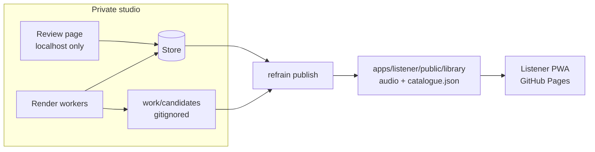

# Architecture

Two systems that share one file format and nothing else.

The arrow only points one way. The listener has no credentials, no database client and no model
API; it fetches JSON and audio from its own origin. That is why the public attack surface is a
static file server, and why a compromise of the studio cannot reach a listener except through a
publish.

## The catalogue is the contract

`packages/catalogue` is the only thing both sides import. It holds:

- **Schemas** for Corpus, Chunk, Preset, Track, Provenance and the Catalogue itself, as Zod
  objects. The pipeline parses with them on the way out; the app parses with them on the way in.
  Neither trusts the file.
- **Route parsing.** `#/{corpus}/{voice}/{style}/{book}/{chunk}` is parsed by shape, then resolved
  against catalogue records. Nothing from a URL is ever rendered.
- **Content hashing.** `buildCatalogue` hashes a canonical form of the whole catalogue;
  `verifyCatalogue` recomputes it. The app refuses a catalogue that does not match its own hash.
- **Source selection.** Each track ships as Opus and AAC; `pickSource` asks the browser which it
  can decode rather than guessing from the user agent.

## Records

| Record | Key fields | Purpose |
| --- | --- | --- |
| Corpus | id, title, edition, author, licence, sourceUrl, books | The rights-cleared text and where it came from |
| Chunk | id, corpusId, bookId, number, title, lines | The unit of rendering: one poem, chapter or scene |
| Preset | id, mode, styleId, voiceId, adapter, params | A reusable render setting |
| Track | id, chunkId, presetId, status, sources, duration, alignment | One rendered take, in every delivery format |
| Provenance | trackId, adapter, model, terms, promptHash, seed, reviewer, verdict, reason | How it was made and who approved it |

A track's id is derived — `{chunkId}--{presetId}` — not assigned, so the same recipe always lands on
the same id and a re-render replaces rather than accumulates.

## Why these choices

| Layer | Choice | Why |
| --- | --- | --- |
| Listener | React + TypeScript + Vite + Tailwind | The spec's stack. Small enough to stay a static bundle, typed enough that the catalogue's schema reaches the components. |
| Routing | Hash routes | GitHub Pages has no rewrite rules, so a deep path 404s. A hash route always loads the one document. |
| Playback | `<audio>` + Media Session API | Streaming, range requests and lock-screen controls without an audio library. |
| Formats | Opus first, AAC second | Opus is about a third smaller; Safari and older iOS need AAC. The browser is asked, not guessed. |
| Offline | Hand-written service worker + Cache Storage | The caching rules are the offline promise; they should be readable, not generated. |
| Store | JSON file behind a `Store` interface | The pilot runs with no services. Postgres is one more implementation, not a rewrite. |
| Icons | Drawn in `make-icons.mjs` with `node:zlib` | One less build dependency to audit. |

## Where the state lives

- `content/` — input. Text and presets, in plain files, in git.
- `data/store.json` — the studio's records. In git for the pilot so the repository is runnable;
  a real deployment points the `Store` at Postgres and gitignores this.
- `work/candidates/` — unpublished audio. Gitignored, never served.
- `apps/listener/public/library/` — the published library. In git so GitHub Pages can serve it
  without a render run.

## What is not built

- Drama mode. The schema carries `mode: 'sung' | 'drama'` and nothing else for it yet.
- Accounts, favourites sync, reading plans. All Phase 2, and all need a live API, which is the
  decision R-2 exists to protect.
- Per-chunk Open Graph images. Share links carry per-chunk titles through the generated share pages;
  the image is the brand card, because rendering text into an image needs a font pipeline that this
  repository deliberately does not have yet.
