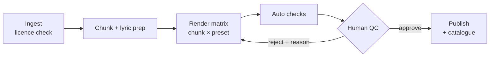

# The pipeline

One batch job with one human gate. Generation is not the bottleneck; review is.



## Stages

| Stage | Command | What it does |
| --- | --- | --- |
| Ingest | `refrain ingest` | Reads `content/corpora/*`, refuses a corpus with no recorded licence or source URL, splits files into chunks, runs the no-word-change gate. |
| Render | `refrain render` | For every chunk × preset: calls the adapter, writes a WAV, encodes Opus and AAC, runs the auto checks, records the track as a candidate with provenance. |
| Review | `npm run studio`, or `refrain approve` / `refrain reject` | A person listens and records a verdict. A rejection carries a reason. |
| Publish | `refrain publish` | Copies approved audio into the public library under content-hashed names, generates `catalogue.json`, `index.json` and the share pages, prunes orphans. |
| Verify | `refrain verify` | Re-parses, re-hashes and re-checks everything published. Runs in CI. |

`refrain pilot` runs the lot with `--allow-auto`, which is the only way a track reaches the library
without a person. It says so, loudly, every time.

## The lyric-prep gate

Sung renders want lines of a workable length; the canonical text does not always give them. Prep may
re-break a line. It may not change a word, and `assertSameWords` proves it: both sides are tokenised
down to bare words and compared with a word-level Levenshtein. A difference throws, naming the words
that moved.

This runs at **ingest**, not at render, so a corpus that cannot be prepared safely never enters the
pipeline at all. The spec suggests an LLM for this step; the gate is model-independent, so a model
can be dropped in behind the same check without loosening it.

## Auto checks

| Check | Fails when |
| --- | --- |
| duration | Seconds per syllable falls outside 0.18–1.6 — a render that raced or dragged. |
| silence | A gap over 2.5s between the first and last sound, or an excessive lead-in or lead-out. Head and tail are judged separately from internal gaps, because they mean different things. |
| clipping | More than a handful of samples at full scale. |
| alignment | Spans out of order, overlapping, zero-length, or running past the end of the audio. |
| accuracy | Word accuracy below 99%, measured by transcribing the render and diffing against the source. |

**A check that cannot run reports `skipped`, never `pass`.** With no transcriber installed the
accuracy check is skipped, the report is marked `incomplete`, and `refrain status` says in plain
words that accuracy has not been measured. This is the difference between a pipeline that knows what
it does not know and one that quietly publishes.

The accuracy check is the one that matters most. Music models drop, repeat and invent words; a
machine catches that far more cheaply than a reviewer does. Install a local whisper build and pass
`--transcriber whisper-cli` to turn it on.

## Render adapters

```ts
interface RenderAdapter {
  readonly name: string;
  readonly description: string;
  render(request: RenderRequest): Promise<RenderResult>;
}
```

A `RenderResult` carries the samples, the sample rate, one alignment span per line, what the adapter
believes it performed, and the model terms it was produced under. The pipeline does the rest:
encoding, loudness, hashing, checks, provenance.

The shipped adapter is `synth`, an additive synthesiser that sets one note per syllable over a
style's chord progression. It is a placeholder, and the app says so. It earns its place for three
reasons a silent fixture cannot: the app has real audio to stream, seek and cache; the line timings
fall out of the same pass that makes the notes, so the synced text has true alignment rather than
guessed offsets; and it costs nothing, so the whole pipeline runs in CI.

To use a real model, write an adapter that calls it, register it, and point a preset at it:

```ts
registerAdapter({
  name: 'suno-like',
  description: 'Calls a music-generation API with commercial output terms.',
  async render({ chunk, preset, lines, seed }) {
    const audio = await callTheModel({ lines, style: preset.styleId, seed });
    return {
      samples: audio.samples,
      sampleRate: audio.sampleRate,
      alignment: await align(audio, lines),   // a real render needs a real aligner
      performed: lines,
      modelId: 'their-model',
      modelVersion: audio.version,
      modelTerms: { url: '…', version: '…', checkedOn: '2026-09-19', commercialUse: true },
    };
  },
});
```

Nothing else changes: the same checks run, the same gate applies, the same catalogue comes out.

### Alignment for real renders

The synth adapter knows its own timings. A model does not, and speech aligners struggle on sung
audio. The workable approach is two steps: separate the vocal from the backing (Demucs or similar),
then force-align the known lyrics against the isolated stem with WhisperX or the Montreal Forced
Aligner. This is the standard karaoke-style pipeline and it is what an adapter should do before
returning `alignment`. Measure it before trusting it: the exit test for this is not "it ran" but
"the highlight lands on the right line for a whole poem".

## Determinism

A render is a pure function of chunk, preset and seed. The synth seeds its generator from
`seedFrom(chunkId, presetId, seed)`, and a test asserts sample-for-sample equality across two runs.
This is what makes R-4 — every track traceable to its recipe — a property rather than a promise.

Re-rendering a track clears any verdict it had. The take being judged has changed, so the approval
no longer applies.
